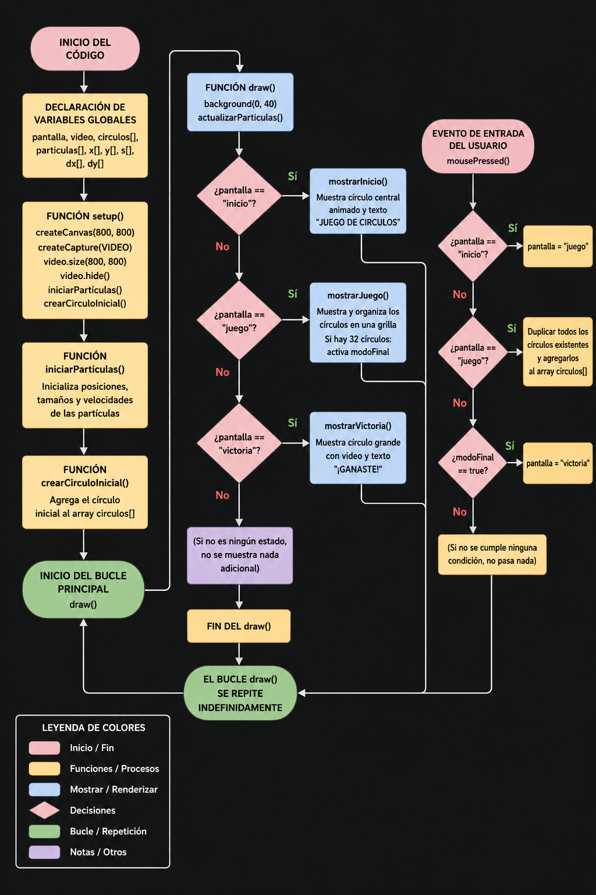

# **Examen**

## Descripción del proyecto

Este proyecto es una experiencia interactiva desarrollada en p5.js que combina elementos de animación, sistemas de partículas y multimedia. El usuario interactúa con una serie de círculos que evolucionan progresivamente en pantalla mediante clics, cambiando entre distintos estados visuales.
El sistema está estructurado en tres fases principales: una pantalla de inicio con partículas animadas, una fase de interacción donde los círculos se multiplican y reorganizan, y una pantalla final donde se presenta una composición visual con video integrado dentro de formas circulares.
El proyecto utiliza conceptos de programación creativa como movimiento aleatorio, interpolación de posiciones, funciones trigonométricas y control de estados para generar una experiencia visual dinámica y reactiva a la interacción del usuario.

## ¿Qué se ve en pantalla?

### Pantalla de inicio
- Fondo oscuro con partículas moradas en movimiento
- Un círculo grande central con efecto de pulso
- Texto de inicio del juego

### Pantalla de juego
- El usuario crea círculos con clicks
- Los círculos se organizan en una grilla
- El sistema evoluciona hasta 32 círculos
- Se activa un modo final con video dentro de los círculos

###  Modo final
- Fondo con partículas dinámicas
- Los círculos muestran un video en su interior
- Estado de transición hacia el final del juego

###  Pantalla de victoria
- Un gran círculo central animado
- Video dentro del círculo principal
- Efecto de partículas de fondo
- Texto de victoria

## Elementos visuales
El proyecto utiliza partículas, círculos interactivos y un video integrado para construir una experiencia visual progresiva basada en estados, donde el sistema evoluciona desde caos inicial hasta una forma final organizada y central.

## Inputs utilizados
El proyecto utiliza principalmente el mouse como forma de interacción del usuario.

- **Click del mouse (`mousePressed`)**: permite avanzar entre las diferentes pantallas del juego, crear nuevos círculos durante la fase de juego y activar el estado final del sistema.
- **Posición del mouse (`mouseX`, `mouseY`)**: influye en el comportamiento de las partículas, generando un efecto de repulsión cuando el cursor se acerca a ellas.
- **Cambio de estados (interno)**: el sistema responde a la interacción del usuario cambiando entre las pantallas de inicio, juego y victoria.

## Outputs generados
El sistema produce distintos outputs visuales dinámicos en tiempo real como resultado de la interacción del usuario y de los algoritmos del código.

- **Partículas animadas**: puntos que se mueven aleatoriamente y reaccionan a la posición del mouse, creando un fondo dinámico.
- **Círculos interactivos**: formas que se generan, se duplican y se organizan en una estructura de grilla durante la fase de juego.
- **Integración de video**: el video se reproduce dentro de círculos y también dentro de una máscara circular en la pantalla de victoria.
- **Estados visuales del sistema**: el proyecto genera tres estados principales (inicio, juego y victoria), cada uno con una composición visual distinta.
- **Efectos de animación**: uso de pulso, transparencia y movimiento continuo para dar sensación de sistema vivo.

# Descripción conceptual del proyecto
## Idea central
La idea principal del proyecto es generar un codigo visual llamativo utilizando comandos vistos en clases, haciendo una experiencia basada en un videojuego
simplificando de igual manera este concepto. El proyecto busca explorar de manera visual 3 distintas etapas de este mismo, generando asi una pantalla de inicio, una de juego y una pantalla final donde el usuario sale vencedor de este sistema. Tambien de esta manera utilizando las reacciones a tiempo real a concecuencia 
del usuario.

## Corriente o referente de diseño
- **Bauhaus**: Se sigue concervando el circulo central utilizado en la solemne II, solo que toma otra interpretación.
- **VideoJuegos**: Toma de referentes videojuegos antiguos y algunos nuevos, para generar aun más esta dinamica.

## Principios de diseño explorados
- **Equilibrio y composición**
- **Transformación y estados**
-  **Movimiento y ritmo**
-  **Interactividad**
-  **Integración multimedia**

## Sistema de interactividad
El proyecto funciona como un sistema interactivo basado en la entrada del usuario y el cambio de estados visuales.

La interacción principal se realiza mediante el mouse, permitiendo generar cambios directos en la composición visual.
- **Click del mouse (`mousePressed`)**: permite avanzar entre estados del sistema, generar nuevos círculos y activar la fase final del proyecto.
- **Movimiento del mouse (`mouseX`, `mouseY`)**: influye en el comportamiento de las partículas, generando efectos de repulsión y dinamismo visual.
- **Sistema de estados**: la experiencia se organiza en tres etapas (inicio, juego y victoria), las cuales modifican completamente la apariencia y comportamiento del sistema.
- 
El sistema responde en tiempo real, generando una experiencia visual dinámica y reactiva.

## Datos de entrada
El sistema recibe entradas del usuario en tiempo real, las cuales determinan el comportamiento y la evolución de la experiencia visual.

- **Click del mouse (`mousePressed`)**
- **Posición del mouse (`mouseX`, `mouseY`)**
- **Estado del sistema (`pantalla`)**
- **Cantidad de círculos (`circulos.length`)**

## Procesamiento
El sistema procesa las entradas del usuario mediante lógica basada en estados, bucles y funciones matemáticas para generar la salida visual en tiempo real.

- **Gestión de estados**: el programa utiliza la variable `pantalla` para determinar qué parte del sistema se ejecuta (inicio, juego o victoria).
- **Bucles (`for`)**: se utilizan para generar y actualizar partículas, así como para distribuir los círculos en la pantalla de forma estructurada.
- **Funciones aleatorias (`random()`)**: permiten el movimiento orgánico de las partículas y la variación visual del sistema.
- **Interpolación (`lerp()`)**: suaviza el movimiento de los círculos al organizarlos en una grilla.
- **Mapeo de valores (`map()`)**: transforma la cantidad de círculos en tamaños dinámicos para efectos visuales.
- **Funciones matemáticas (`sin()`)**: generan animaciones de pulso y movimiento continuo.
- **Procesamiento multimedia**: el video es renderizado dentro de formas circulares mediante recorte y redimensionamiento.

## Diagrama de flujo
.
